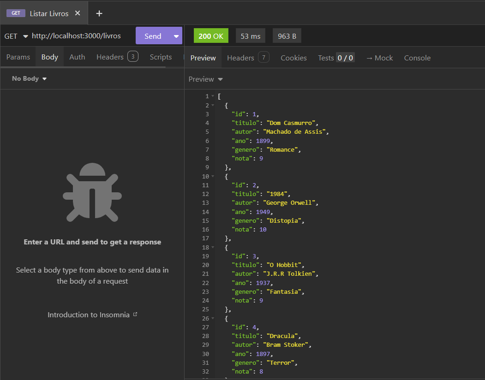
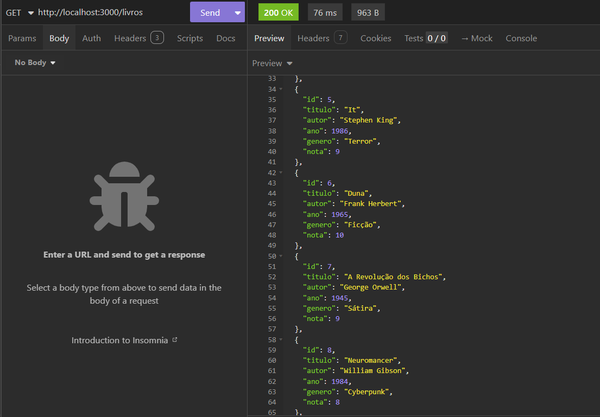
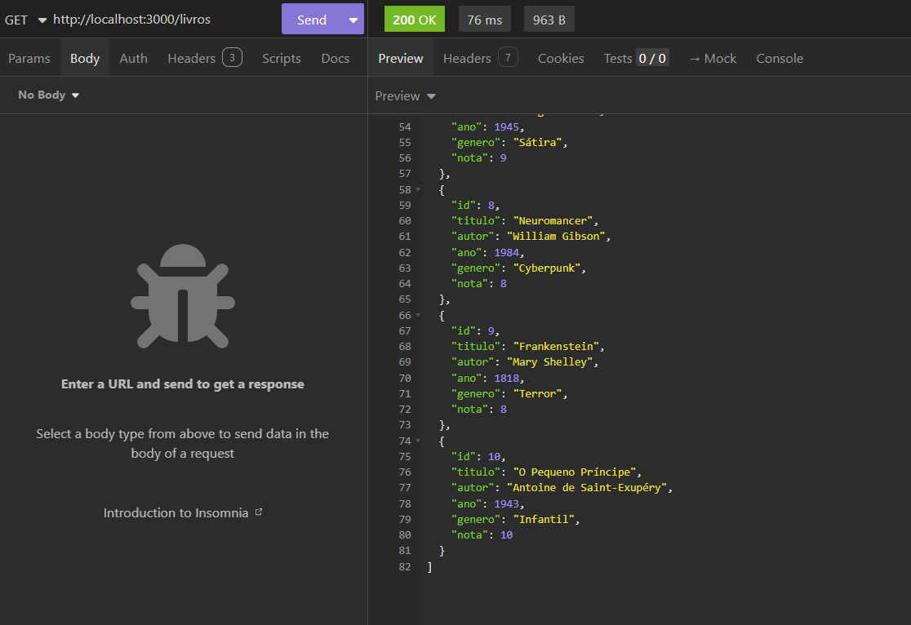
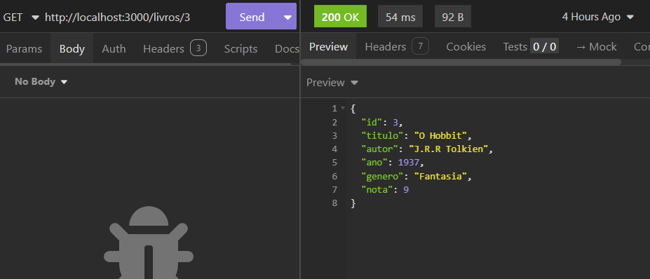
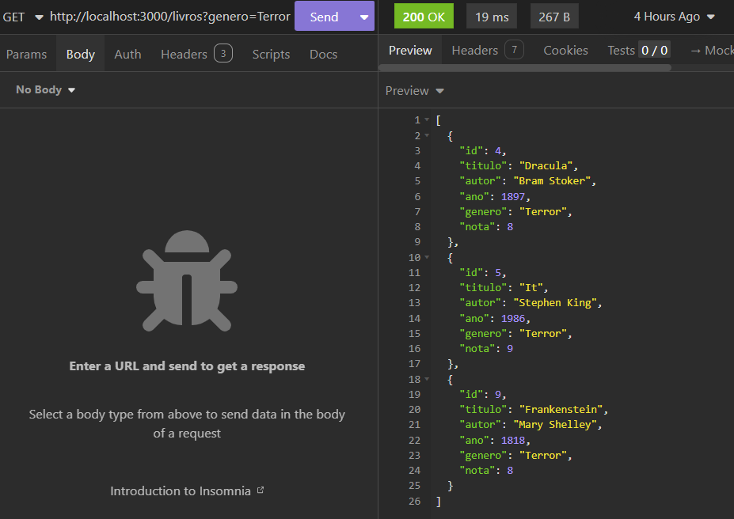
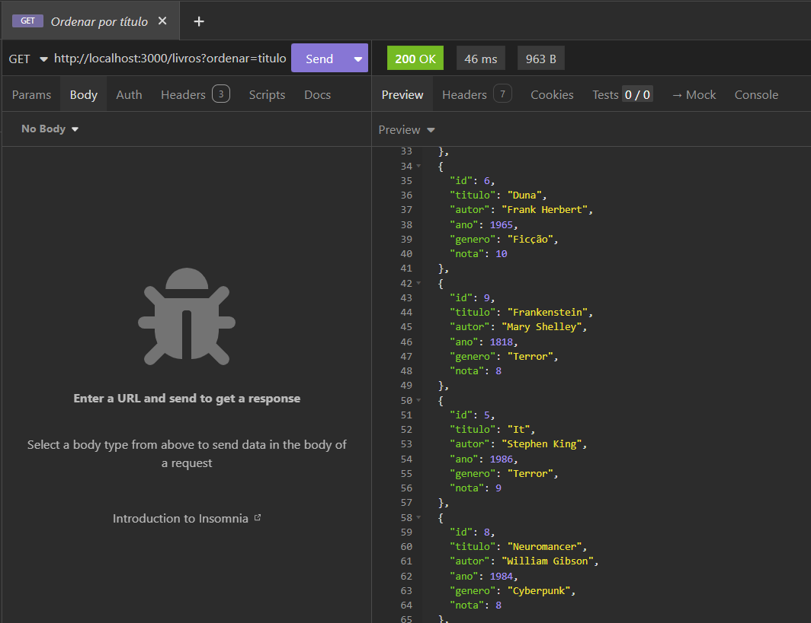
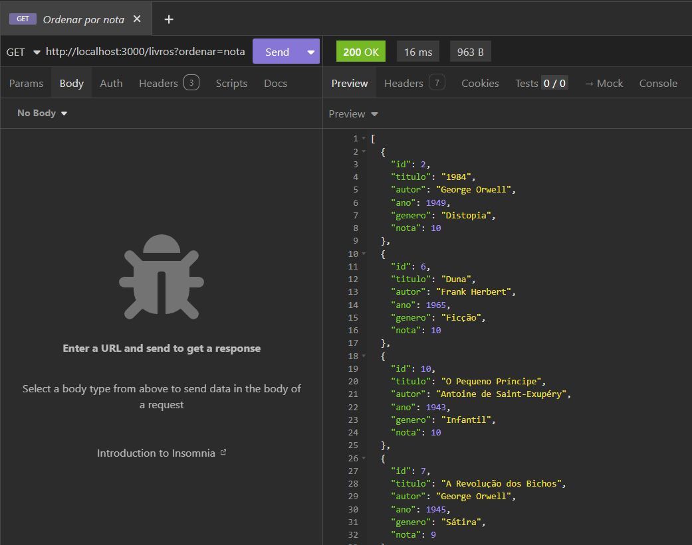
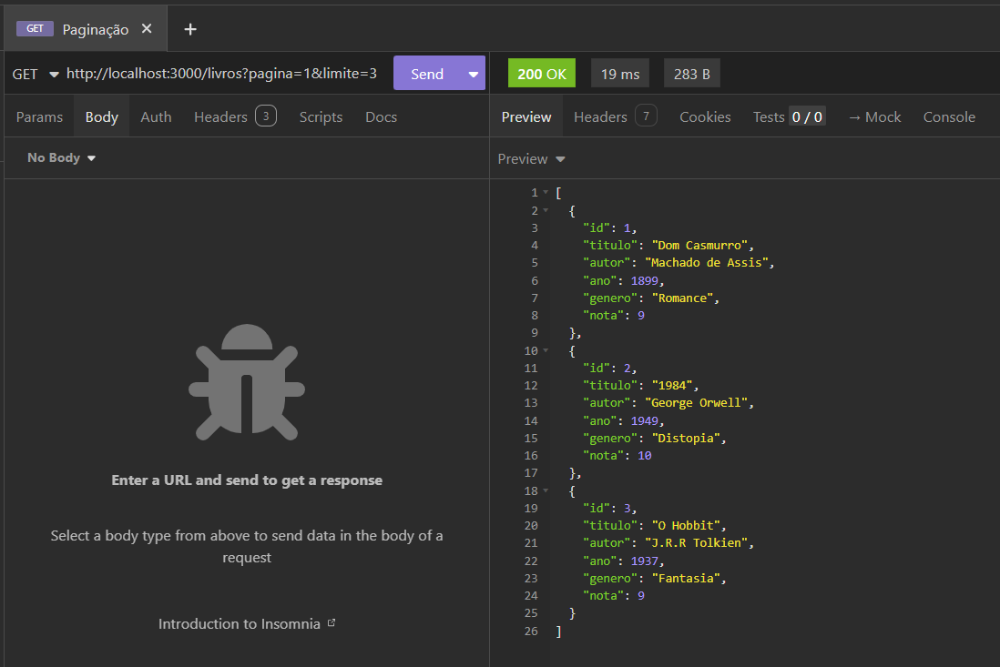
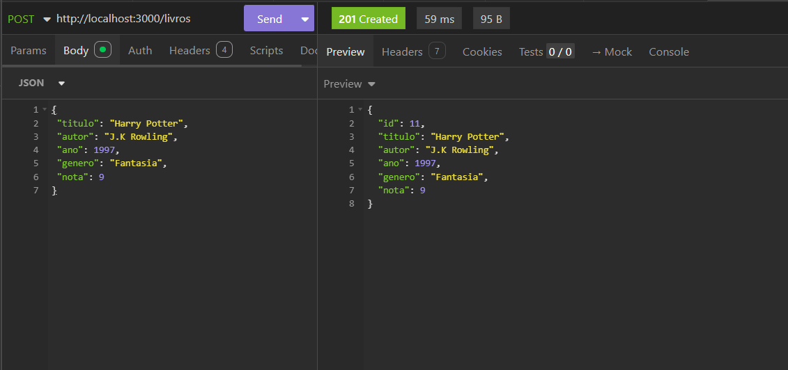
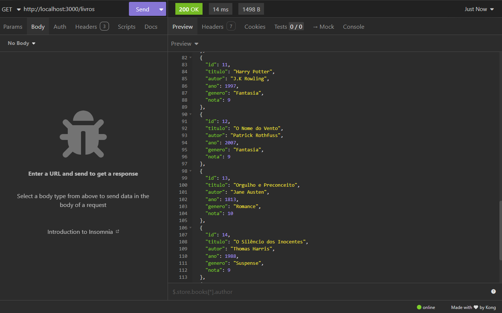

# API REST de Livros
## Atividades 1 e 2
### API REST desenvolvida em Node.js utilizando Express, com o objetivo de gerenciar uma coleção de livros.
#### Aluna: Sibelly Vitória Antonio
---

#  Funcionalidades

- Listar todos os livros  
- Buscar livro por ID  
- Filtrar por gênero  
- Ordenar por título e nota  
- Paginação dos resultados  
- Criar novos livros (POST)  

---

# Como executar o projeto

```bash
npm install
node server.js

---

# Endpoints da API

## 1️. Listar todos os livros

**Método:** GET  
**URL:** `/livros`

Resultado:





---

## 2️. Buscar livro por ID

**Método:** GET  
**URL:** `/livros/:id`

Exemplo: /livros/1

Resultado:



---

## 3️. Filtrar por gênero

**Método:** GET  
**URL:** `/livros?genero=Fantasia`

Resultado:



---

## 4. Ordenação

### 🔹 Por título

**Método:** GET  
**URL:** `/livros?ordenar=titulo`

Resultado:



---

### 🔹 Por nota

**Método:** GET  
**URL:** `/livros?ordenar=nota`

Resultado:



---

## 5️. Paginação

**Método:** GET  
**URL:** `/livros?pagina=1&limite=3`

Resultado:



---

## 6️. Criar novo livro

**Método:** POST  
**URL:** `/livros`

### Body da requisição

```json
{
 "titulo": "Harry Potter",
 "autor": "J.K Rowling",
 "ano": 1997,
 "genero": "Fantasia",
 "nota": 9
}

Resultado: 



---

## 7. Lista atualizada após POST

**Método:** GET
**URL:** `/livros`

Resultado: 



